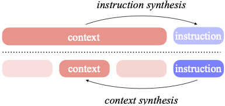

## Generalizing from Short to Long: Effective Data Synthesis for Long-Context Instruction Tuning
<p align="center">
  <a href="https://arxiv.org/pdf/2502.15592"> 📃 Paper</a> | 
  <a href="https://huggingface.co/Wenhao97"> 🤗 Huggingface</a> | 
  <a href="https://owennju.github.io/"> 📭 Contact</a> 
</p>


### :mountain: Overview
This repository contains data synthesis scripts and resources for conducting long-context instruction tuning. In this project, we introduce "context synthesis", a novel approach that leverages off-the-shelf LLMs (such as GPT-4o, Qwen-2.5, LongWriter) to generate high-quality background context from short-context instruction-answer pairs.

This approach offers three advantages: 
  
  (1) in contrast to previous work which synthesizes instructions and target outputs, our synthetic data only forms part of the input to the model rather like [back-translation](https://aclanthology.org/P16-1009.pdf) for machine translation, preserving the quality of instructions and outputs. 

  (2) by generating background contexts, we can seamlessly integrate both supporting evidence and distracting information into a coherent narrative. 

  (3) our approach enables control over context through expansion and concatenation to harness the benefits of training on longer sequences.

<p align="center">
  
</p>

### :hammer_and_wrench: Data Synthesis
We provide the scripts of context synthesis to build long-context instruction data.

#### Synthesis scripts: 
```
cd scripts
bash context_synthesis.sh
```

#### Key Components
- `generate_synthetic_context.py`: Generates background context based on instruction-answer pairs
- `convert_to_chat_format.py`: Wraps the data in chat format, and extends context length by concatenating multiple contexts (optional)
- We use [vllm](https://github.com/vllm-project/vllm) as the inference engine for open-source LLMs. Please follow their repository instructions to set up the inference environment
- For proprietary models like GPT-4o, we recommend using batched API calls to save costs (script coming soon)

#### Data Download 
In our experiments, we perform both:
- Context synthesis (with instructions in `./seed_instruction`)
- Instruction synthesis (with context in `./seed_context`)

Our synthesized data is available in our [Hugging Face collection](https://huggingface.co/collections/Wenhao97/long-context-instruction-data-synthesis-67befdfd734ffcc7882573bf).

### :hourglass_flowing_sand: Instruction-tuning
We utilize the LongAlign framework for long-context instruction-tuning:

- For LLaMA2-7B: We use the original LongAlign codebase (https://github.com/THUDM/LongAlign)
- For LLaMA3.1-8B: We use LongWriter, an updated version of LongAlign that supports LLaMA3.1 series models (https://github.com/THUDM/LongWriter)

### :straight_ruler: Evaluation
For model evaluation, we employ several document-level benchamrks. Please refer to their respective repositories for detailed implementation and usage instructions.

- LongBench: https://github.com/THUDM/LongBench
- RULER: https://github.com/NVIDIA/RULER
- ZeroScrolls: https://github.com/tau-nlp/zero_scrolls

### :evergreen_tree: Citation
```
@misc{zhu2025generalizingshortlongeffective,
      title={Generalizing From Short to Long: Effective Data Synthesis for Long-Context Instruction Tuning}, 
      author={Wenhao Zhu and Pinzhen Chen and Hanxu Hu and Shujian Huang and Fei Yuan and Jiajun Chen and Alexandra Birch},
      year={2025},
      eprint={2502.15592},
      archivePrefix={arXiv},
      primaryClass={cs.CL},
      url={https://arxiv.org/abs/2502.15592}, 
}
```
